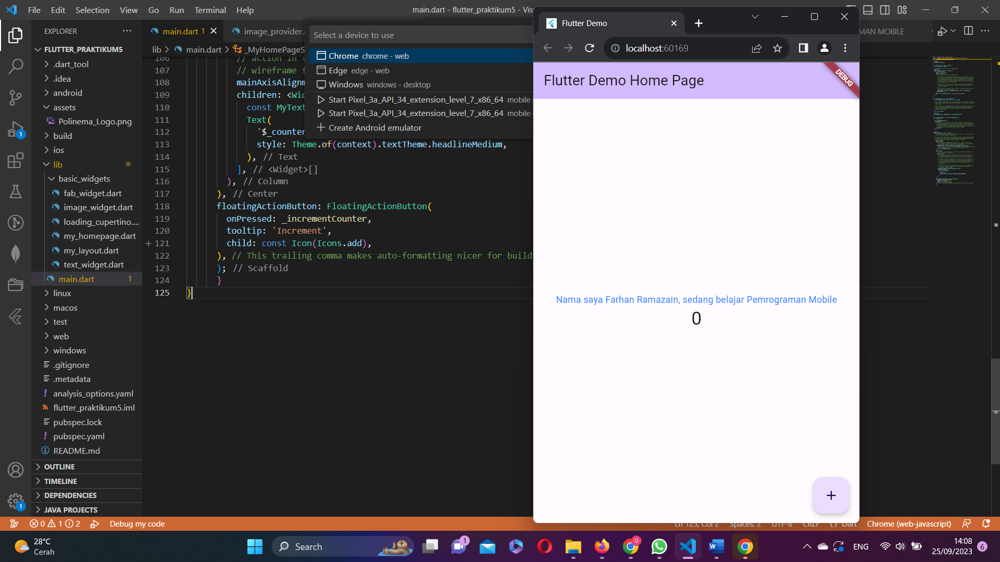
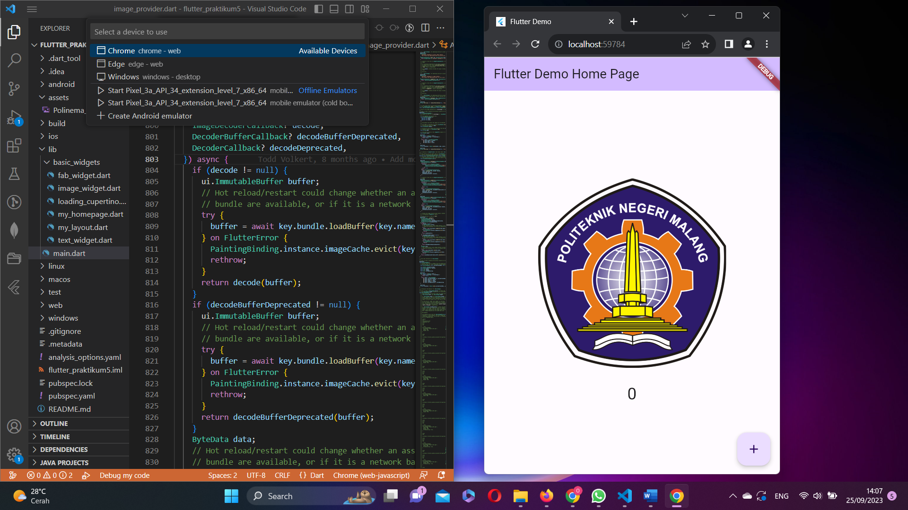
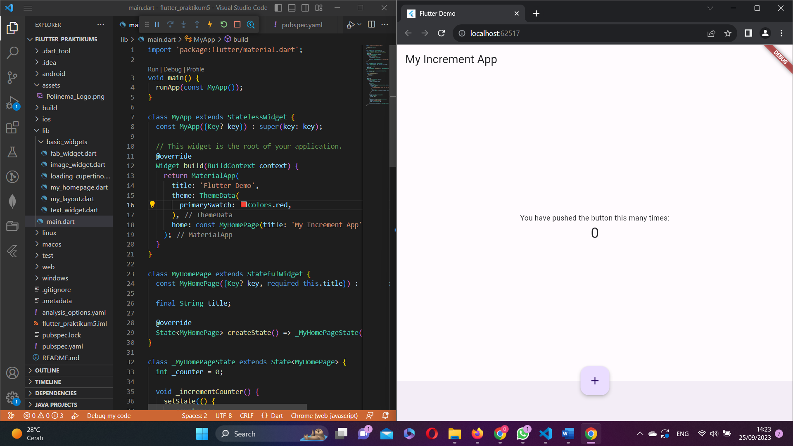
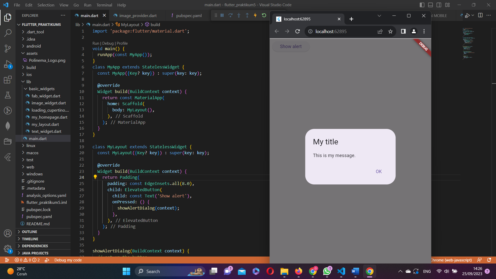
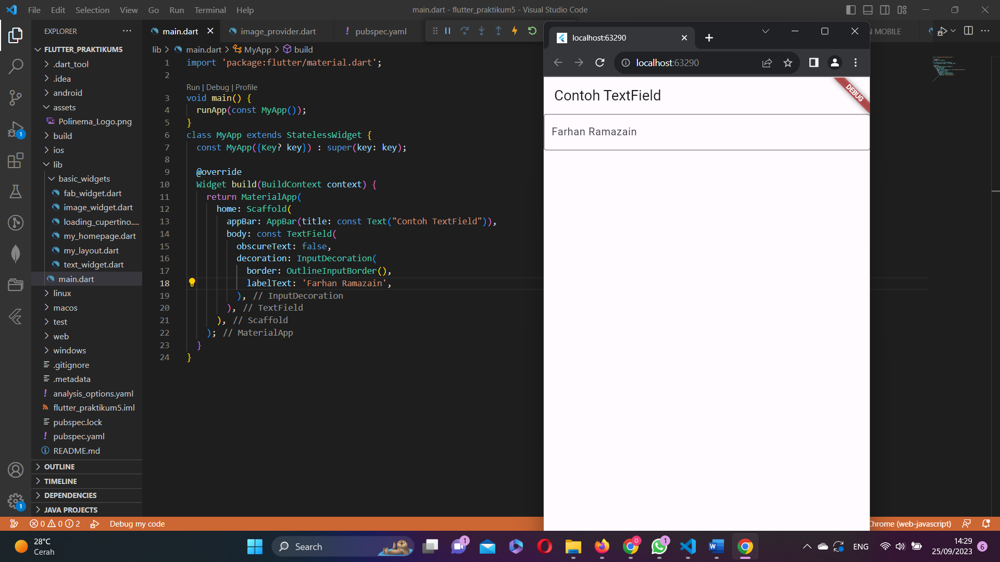
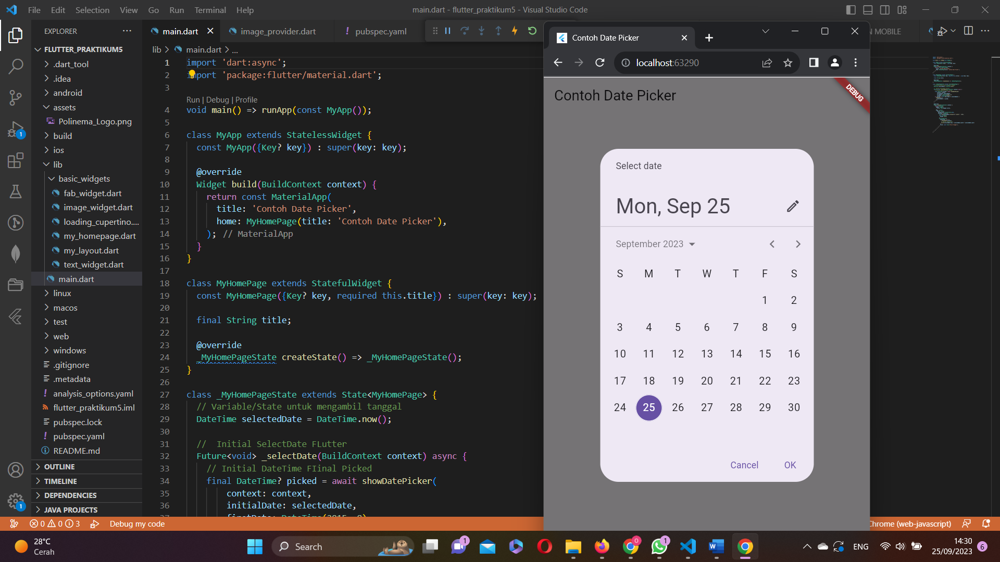

# flutter_praktikum5
Pada minggu ke-5 ini, saya mempelajari konsep dan praktik untuk dasar-dasar framework Flutter, termasuk fitur hot reload dan restart, serta widget dasar, dan tema nya. Untuk itu, sebelumnya saya telah mempersiapkan sumber daya yang dibutuhkan.

# PRAKTIKUM 3
## Text Widget 
Mengganti isi teks dan warnanya menjadi biru

## Image Widget
Kemudian menambahkan logo Polinema.

# PRAKTIKUM 4
## Scaffold Widget
Implementasi scaffold widget yang digunakan untuk mengatur tata letak sesuai dengan material design.

## Dialog Widget
Menambahkan alert dialog.

## Input and Selection Widget
Menambahkan widget berupa input field untuk menerima inputan dari user, di sini saya menambahkan TextField.

## Date and Time Picker 
Menambahkan date and time picker, yang dapat menerima input berupa selection (pemilihan tanggal dan waktu).

## Getting Started

